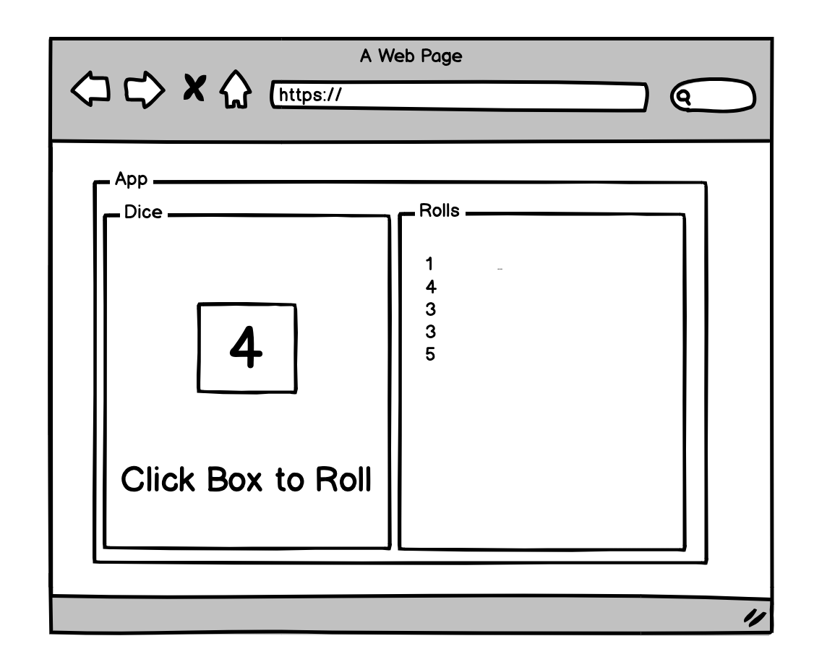

# Dice Roller Challenge

- As a user, I can see an application called Dice Roller
- As a developer, I can create a React application with App.js as my stateful component
- As a developer, I can create two child components that will accept props from App.js
- As a user, I can click a box and see the outcome of my current "roll"
- As a developer, I can pass a method from App.js to my dice component to display a number between 1 and 6
- As a user, I can see my roll logged
- As a developer, I can pass the value of the roll to a log component
As a user, I can see the roll log continue to grow as I roll the dice

### Stretch Goals
- As a user, I can see the image of a dice face when I "roll" the dice
- As a user, I can click a restart button that clears my roll log

